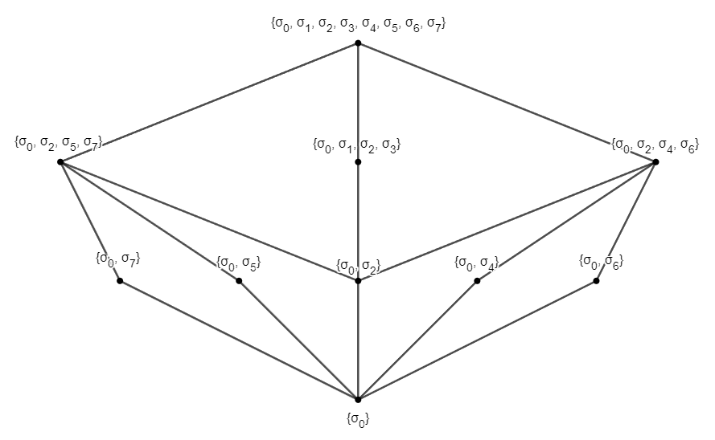
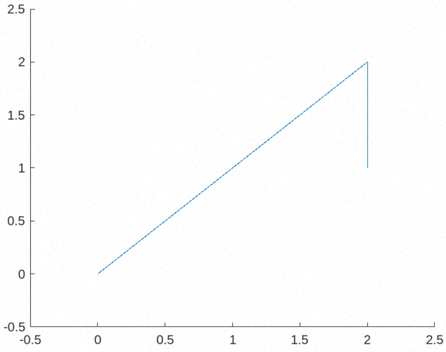
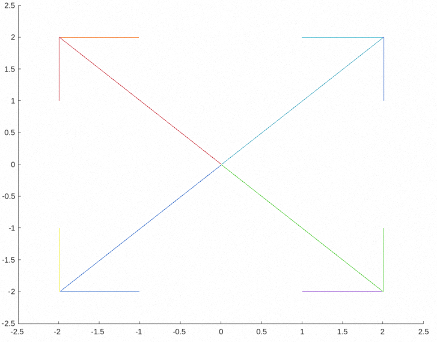
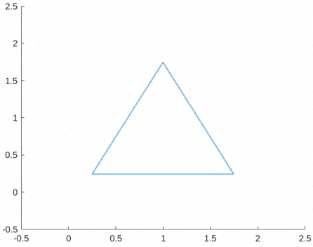
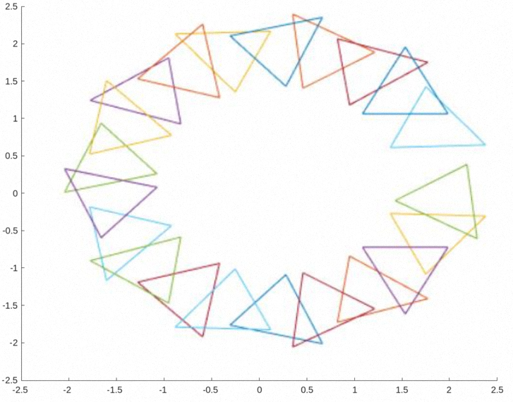

# **Étude des groupes, sous-groupes et transformations de motifs**

> UTBM - P2023 - MV51 - TP1 - Julien CONSTANT

**Le plan $P$ est rapporté à un repère orthonormé direct $(O, \vec{i}, \vec{j})$.  
On note $r_\theta$ la rotation de centre $O$ et d'angle $\theta$, $s$ la symétrie orthogonale de miroir $(O, \vec{i})$.**

## **1. Outils de base**

1. **Écrire une fonction `rote(θ, (x, y))` qui, à partir d'un point $m(x, y)$ et de $\theta$ fournit le couple $(x^\prime, y^\prime)$ des coordonnées du point $m^\prime = r_\theta(m)$.**

    On utilise la matrice de rotation usuelle suivante à laquelle on multiplie un point $M(x, y)$ :
    $$
    r = \left( \begin{array}{cc}
    \cos{\theta} & -\sin{\theta} \\\\
    \sin{\theta} & \cos\theta \end{array} \right)
    $$

    Ce qui donne le code suivant :

    ```matlab
    % rote.m

    function [m] = rote(theta, M)
      theta_deg = theta * pi / 180;
      r = [cos(theta_deg), -sin(theta_deg); sin(theta_deg), cos(theta_deg)];
      m = r * M';
    end
    ```

    Exemple :

    ```matlab
    >> rote(90, [1, 0])

    ans =
      0.0000
      1.0000
    ```

2. **Écrire une fonction `sym((x, y))` qui à partir d'un point $m(x, y)$ fournit le couple $(x^\prime, y^\prime)$ des coordonnées du point $m^\prime = s(m)$.**

    Pour écrire la symétrie selon l'axe $O\vec{i}$, il suffit de prendre l'opposée de la première composante $y$ du point $M(x, y)$.

    Ce qui donne le code suivant :

    ```matlab
    % symmetry_oi.m

    function res = symmetry_oi(M)
      x = M(1);
      y = M(2);
      res = [x -y];
    end
    ```

    Exemple :

    ```matlab
    >> symmetry_oi([4, 3])

    ans =
       4
      -3
    ```

## **2. Étude du groupe diédral $(D_{2n}, \circ)$ pour $n = 4$**

**On pose d'abord $n = 4$ et $r_\theta = r_{\pi/2}$.**

1. **On considère l'ensemble des transformations du plan défini par**
    $$
    D_8 = \\{ \sigma_{0}, \dots, \sigma_{2n-1} \\} = \\{ r^0, r^1, r^2, r^3, s, s \circ r^1, s \circ r^2, s \circ r^3 \\}
    $$

    **En utilisant les résultats des travaux dirigés, rappeler le lemme fondateur et écrire les fonctions :**

    - **`trad_dec_qu(k)`, qui à partir de $k \in \\{ 0, \dots, 2n - 1 \\}$, fournit $(\alpha, \beta)$ tel que, en base quatre, $k$ s'écrive $\alpha\beta$;**
    - **`trad_qu_dec((α, β))`, qui à partir de $(\alpha, \beta)$ considéré comme écriture en base quatre, renvoie l'entier décimal $k$ associé.**

    <br/>

    Le lemme fondateur vu en TD est le suivant :
    $$
    r^0 = \sigma_0; \
    r^1 = \sigma_1; \
    r^2 = \sigma_2; \
    r^3 = \sigma_3; \
    s = \sigma_4; \
    s \circ r^1 = \sigma_5; \
    s \circ r^2 = \sigma_6; \
    s \circ r^3 = \sigma_7; \\\\
    \forall{i, j, k \in 0, \dots, 7 \sigma_i \circ \sigma_j = \sigma_k}
    $$

    Et lorsque $i_10 = (\alpha_i \beta_i)_4; j_10 = (\alpha_j \beta_j)_4$ alors $k = (\alpha\beta)_4$ avec $\alpha = (\alpha_i + \alpha_j)\times\mod{(2)}$ et $\beta = (-1^{\alpha_j}\beta_j + \beta_j)\times\mod{(4)}$.

    On obtient les fonctions suivantes dans Matlab :

    ```matlab
    % trad_dec_qu.m 
    
    function [alpha, beta] = trad_dec_qu(k)
      alpha = fix(k / 4);
      beta = mod(k, 4);
    end
    ```

    ```matlab
    % trad_qu_dec.m 

    function k = trad_qu_dec(ab)
      alpha = ab(1);
      beta = ab(2);
      k = 4 * alpha + beta;
    end
    ```

    Exemple :

    ```matlab
    k = 23;
    [a, b] = trad_dec_qu(k);
    disp([a, b]); % affiche [5, 3]

    ab = [1, 2];
    k = trad_qu_dec(ab);
    disp(k); % affiche 6
    ```

2. **Utiliser les résultats antérieurs et le travail préparatoire mené en td, pour construire la table $(tab(i, j))_{0 \leq i, j \leq 2n - 1}$ de la loi $\circ$ sur $D_8$. Pour ce faire, on écrira une fonction `compose(σi, σj)` qui à partir des transformations $\sigma_i$ et $\sigma_j$ de $D_8$, détermine l'entier $k$ compris entre $0$ et $2n - 1$ défini par : $\sigma_i \circ \sigma_j = \sigma_k$.**

    Voici une implémentation de la fonction `compose(σi, σj)` :

    ```matlab
    % compose.m

    function k = compose(sigma_i, sigma_j)
      alpha = mod((sigma_i(1) + sigma_j(1)), 2);
      beta = mod((-1)^(alpha_j) * beta_i + beta_j, 4);
      k = trad_qu_dec([alpha, beta]);
    end
    ```

    Pour construire la table de la loi $\circ$ sur $D_8$, on peut utiliser la fonction suivante :

    ```matlab
    function res = tab(n)
      v = 0 : (2 * n - 1);
      comb = combvec(v, v);
      comb1 = comb(1, :);
      comb2 = comb(2, :);
      arr = arrayfun(@compose, comb1, comb2);
      res = reshape(arr, 2 * n, 2 * n);
    end
    ```

    Exemple:

    ```matlab
    >> tab(4)

    ans =
      0  1  2  3  4  5  6  7
      1  2  3  0  7  4  5  6
      2  3  0  1  6  7  4  5
      3  0  1  2  5  6  7  4
      4  5  6  7  0  1  2  3
      5  6  7  4  3  0  1  2
      6  7  4  5  2  3  0  1
      7  4  5  6  1  2  3  0
    ```

3. **Faire le plan des propriétés à établir pour démontrer que $(D_8, \circ)$ est un groupe non abélien; on fournira le plan sommaire des algorithmes qui permettront de l'établir.**  
**Écrire une fonction `inverse(i)` qui, à partir de la transformation $\sigma_i$ envoie le numéro $j$ de son inverse dans le groupe; on évitera tout algorithme de recherche poussif et on privilégiera d'éventuels résultats théoriques obtenus en travaux dirigés.**

    Un groupe abélien consiste en un groupe dont la loi de composition est commutative. Pour montrer que $D_8$ n'est pas abélien, il suffit de démontrer que la loi de composition interne de ce groupe n'est pas commutative.

    Ainsi pour $(D_8,\circ)$, il faut démontrer que $\exists i, j$ tels que $\sigma_i \circ \sigma_j \neq \sigma_j \circ \sigma_i$. Or ce résultat est déjà démontrer lorsqu'on observe le tableau obtenu dans la question précédente. En effet, le tableau n'est pas symétrique par rapport à sa diagonale, démontrant qu'il existe plusieurs cas où $\sigma_i \circ \sigma_j \neq \sigma_j \circ \sigma_i$.

    Pour déterminer l'inverse de $\sigma_i$, noté $\sigma_j$ on peut utiliser la propriété de l'inverse : $\sigma_i \circ \sigma_j = id$. Par conséquent, on doit déterminer $i$ et $j$ tel que $\sigma_i \circ \sigma_j = \sigma_0$, il suffit alors de regarder dans le tableau précédemment obtenu pour déterminer l'intersection entre $i$ et $j$ qui correspond à $\sigma_0$ :

    ```matlab
    % inverse.m

    function j = inverse(i)
      t = tab(4);
      row_i = t(i + 1, :);
      j = find(row_i == 0) - 1;
    end
    ```

4. **Stocker la table relative au groupe diédral $D_8$.**

    ```matlab
    >> tableau_d8 = tab(4)

    tableau_d8 =
      0  1  2  3  4  5  6  7
      1  2  3  0  7  4  5  6
      2  3  0  1  6  7  4  5
      3  0  1  2  5  6  7  4
      4  5  6  7  0  1  2  3
      5  6  7  4  3  0  1  2
      6  7  4  5  2  3  0  1
      7  4  5  6  1  2  3  0
    ```

5. **Déterminer l'ensemble des sous-groupes de $D_8$, en utilisant les sous-groupes engendrés par chacun des éléments du groupe, puis par deux éléments bien choisis.**

    - **Construire les outils logiciels nécessaires en prévoyant leur généralisation éventuelle.**
    - **Fournir le diagramme de Hasse des sous-groupes de $D_8$. pour la relation d'inclusion.**

    Pour cela, nous allons utiliser deux fonctions pour générer les sous-groupes, la première permet de générer un sous-groupe à partir d'un ensemble donné de fonction, dont chaque fonction du groupe diédral est représentée par son index ($\sigma_0, \sigma_1, \dots$) :

    ```matlab
    % sous_groupe.m

    function sous_groupe(vec)
      while true
        comb = combvec(vec, vec)
        comb1 = comb(1, :);
        comb2 = comb(2, :);

        arr = arrayfun(@compose, comb1, comb2);
        nvec = unique([vec arr]);

        if isequal(nvec, unique(vec))
          vec = nvec;
          break;
        end

        vec = nvec;

      end
      vec(end + 1; 8) = -1;
      res = vec;
    end
    ```

    La seconde, permet à partir de la première de créer tous les groupes généré par un ensemble de fonction. On arrête la génération de sous-groupe lorsque l'on a trouvé tous les sous-groupes possibles (on retombe sur des combinaisons déjà trouvées) :

    ```matlab
    function res = tous_les_sous_groupes()
      elements = 0 : 2 * 4 - 1;
      max_card = 0;
      sub_groups_arr = [];
      index = 0;

      while max_card < length(elements) - 1:
        index = index + 1;
        vec = nchoosek(elements, index);
        [nvec, ~] = size(vec);

        for row_i = 1 : 1 : nvec
          row_curr = vec(row_i, :);
          ngroup = sous_groupe(row_curr);
          sub_groups_arr = [sub_groups_arr; ngroup];

          if sum(ngroup >= 0) > max_card
            max_card = sum(ngroup >= 0);
          end
        end
      end

      res = unique(sub_groups_arr, 'rows');
    end
    ```

    On peut alors générer tous les sous-groupes de $D_8$ :

    ```matlab
    >> tous_les_sous_groupes()

    ans =
      0 -1 -1 -1 -1 -1 -1 -1
      0  1  2  3 -1 -1 -1 -1
      0  1  2  3  4  5  6  7
      0  2 -1 -1 -1 -1 -1 -1
      0  2  4  6 -1 -1 -1 -1
      0  2  5  7 -1 -1 -1 -1
      0  4 -1 -1 -1 -1 -1 -1
      0  5 -1 -1 -1 -1 -1 -1
      0  6 -1 -1 -1 -1 -1 -1
      0  7 -1 -1 -1 -1 -1 -1
    ```

    On obtient respectivement les ensembles suivants :
    $$
    \\{\sigma_0\\};
    \\{\sigma_0, \sigma_1, \sigma_2, \sigma_3\\};
    \\{\sigma_0, \sigma_1, \sigma_2, \sigma_3, \sigma_4, \sigma_5, \sigma_6, \sigma_7\\};
    \\{\sigma_0, \sigma_2\\};
    \\{\sigma_0, \sigma_2, \sigma_4, \sigma_6\\};
    \\{\sigma_0, \sigma_2, \sigma_5, \sigma_7\\};\\\\
    \\{\sigma_0, \sigma_4\\};
    \\{\sigma_0, \sigma_5\\};
    \\{\sigma_0, \sigma_6\\};
    \\{\sigma_0, \sigma_7\\};
    $$

    Et le diagramme de Hasse suivant :

    

## **3. Étude du groupe diédral $(D_{2n}, \circ)$ pour $n$ quelconque**

**Reprendre la théorie antérieure (hormis la question 5, dans un premier temps...) pour un entier $n$ quelconque supérieur à 2. On écrira les fonctions généralisées de celles déjà écrites, en considérant $n$ comme paramètre complémentaire.**

Généralisation des fonctions `trad_dec_qu(k)` et `trad_qu_dec((α, β))` pour fonctionner avec n'importe quelle base $n$ :

```matlab
% trad_dec_n.m 

function [alpha, beta] = trad_dec_n(k)
  alpha = fix(k / n);
  beta = mod(k, n);
end
```

```matlab
% trad_n_dec.m 

function k = trad_n_dec(ab, n)
  alpha = ab(1);
  beta = ab(2);
  k = n * alpha + beta;
end
```

Généralisation de la fonction `compose(σi, σj)` pour fonctionner avec $n$ quelconque, la composée de $\sigma_i$ par $\sigma_j$ pour $D_{2n}$ :

```matlab
% compose_n.m

function k = compose_n(sigma_i, sigma_j, n)
  [alpha_i, beta_i] = trad_dec_n(sigma_i);
  [alpha_j, beta_j] = trad_dec_n(sigma_j);

  alpha = mod(alpha_i + alpha_j, n);
  beta = mod((-1)^(alpha_j) * beta_i + beta_j, n);

  k = trad_n_dec([alpha, beta], n);
end
```

Généralisation de la fonction de génération de tableau `tab(n)` :

```matlab
% tab_n.m

function res = tab_n(n)
  v = 0 : (2 * n - 1);
  comb = combvec(v, v);
  comb1 = combinations(1, :);
  comb2 = combinations(2, :);

  arr = arrayfun(@compose_n, comb1, comb2, n * ones(1, length(comb1)));
  res = reshape(arr, 2 * n, 2 * n);
end
```

Généralisation de la fonction inverse `inverse(i)` pour $D_{2n}$ :

```matlab
% inverse_n.m

function j = inverse_n(i, n)
  t = tab_n(n);
  row_i = t(i + 1, :);
  j = find(row_i == 0) - 1;
end
```

Généralisation de la fonction `sous_groupe(i)` pour $D_{2n}$ :

```matlab
% sous_groupe_n.m

function res = sous_groupe_n(i, n)
  while true:
    comb = combvec(vec, vec);
    comb1 = comb(1, :);
    comb2 = comb(2, :);

    arr = arrayfun(@compose_n, comb1, comb2, n * ones(1, length(comb1)));
    nvec = unique([vec arr]);

    if isequal(nvec, unique(vec))
      vec = nvec;
      break;
    end

    vec = nvec;
  end
  vec(end + 1 : 2 * n) = -1;
  res = vec;
end
```

Généralisation de la fonction `tous_les_sous_groupes()` pour $D_{2n}$ :

```matlab
% tous_les_sous_groupes_n.m

function res = tous_les_sous_groupes_n(n)
  elements = 0 : 2 * n - 1;
  max_card = 0;
  sub_groups_arr = [];
  index = 0;

  while max_card < length(elements) - 1:
    index = index + 1;
    vec = nchoosek(elements, index);
    [nvec, ~] = size(vec);

    for row_i = 1 : 1 : nvec
      row_curr = vec(row_i, :);
      ngroup = sous_groupe_n(row_curr, n);
      sub_groups_arr = [sub_groups_arr; ngroup];

      if sum(ngroup >= 0) > max_card
        max_card = sum(ngroup >= 0);
      end
    end
  end

  res = unique(sub_groups_arr, 'rows');
end
```

## **4. Transfère d'un motif**

**On considère un motif de base $\cal{M}_0$ $= [OA] \cup [AB]$ constitué de la réunion des segments indiqués, avec $A(2, 2)$ et $B(2, 1)$.**  
**On fait opérer les transformations du plan sur les points, comme d'ordinaire, via $\sigma \times m = \sigma (m)$.**  

Visualisation du motif de base $\cal{M}_0$ :

```matlab
% Motif de base M0

>> M = [0, 0; 2, 2; 2, 1];

M =
  0 0
  2 2
  2 1

>> plot(M(:, 1), M(:, 2), -.5, -.5, 2.5, 2.5);
```

<p align="center">

</p>

  1. **Pour chaque sous-groupe $H$ de $D_8$, représenter le motif $\cal{M}$ $_H$ obtenu en faisant opérer le sous-groupe $H$ sur $\cal{M}_0$. On pourra écrire une fonction `creat_motif(H)` qui à partir du sous-groupe passé comme paramètre sous une forme choisie par l'étudiant, produira une figure représentant $\cal{M}$ $_H$.**

      On réalise donc la fonction `creat_motif(H)` à l'aide des fonctions des précédents points et ce, afin de faire correspondre chaque $\sigma_k$ à sa combinaison d'application correspondante :

      ```matlab
      % apply_sigma.m

      function res = apply_sigma(sigma_k, point, n)
        theta = 360 / n;
        nb_rot = mod(sigma_k, n);
        nb_sym = fix(sigma_k / n);
        npoint = point;

        for i = 1 : nb_sym
          npoint = symmetry_oi(npoint);
        end

        for i = 1 : nb_rot
          npoint = rote(theta, npoint);
        end

        res = npoint;
      end
      ```

      ```matlab
      % apply_sigma_motif

      function final = apply_sigma_motif(sigma_k, motif, n)
        nmotif = zeros(size(motif));

        for row_i = 1 : length(motif)
          nmotif(row_i, :) = apply_sigma(sigma_k, motif(row_i, :), n);
        end

        final = nmotif;
      end
      ```

      ```matlab
      % creat_motif.m

      function [] = creat_motif(motif, h, n)
        all_motif = [];

        clf
        hold on

        for i = 1 : length(h)
          nmotif = apply_sigma_motif(h(i), motif, n);
          all_motif = [all_motif; nmotif];
          plot(nmotif(:, 1), nmotif(:, 2));
        end

        axis([min(all_motif(:,1)) -.5 max(all_motif(:,1)) +.5 ... min(all_motif(:,2)) -.5 max(all_motif(:,2)) +.5])

        hold off
      end
      ```

      On peut créer alors le motif suivant :

      ```matlab
      >> creat_motif(M, [0, 1, 2, 3, 4, 5, 6, 7], 4);
      ```

      <p align="center">
      
      </p>

  2. **Expliquez brièvement, mais avec précision, quelle stratégie vous adopterez, si vous devez transférer un motif obtenu à partir d'une forme de base élémentaire, sous l'opération d'un groupe donné.**

      Dans la mesure ou les fonctions données précédemment sont déjà généralisées, il suffit de modifier l'angle de rotation $\theta$ en fonction de $n$ si l'on souhaite transférer un motif obtenu à partir d'une forme de base sous l'opération d'un groupe quelconque.

      Par exemple, pour $n = 3$, on a :

      $$\theta = 2 \times \pi/3 = \frac{2\pi}{3}$$

  3. **Prolongement éventuel : reprendre l'exercice avec un motif de base $\cal{M}_0$ plus élaboré !**

      Prenons le groupe $D_{21}$ à un triangle :

      ```matlab
      >> T = [1 1; 1.5 2; 2 1; 1 1];

      T = 
        1.0000    1.0000
        1.5000    2.0000
        2.0000    1.0000
        1.0000    1.0000

      >> plot(T(:, 1), T(:, 2), .5, .5, 2.5, 2.5);
      ```

      <p align="center">
      
      </p>

      Ce qui donne une fois complet :

      <p align="center">
      
      </p>
