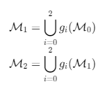
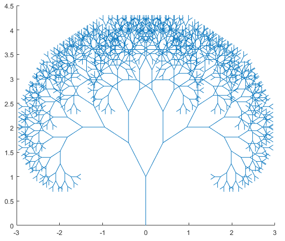
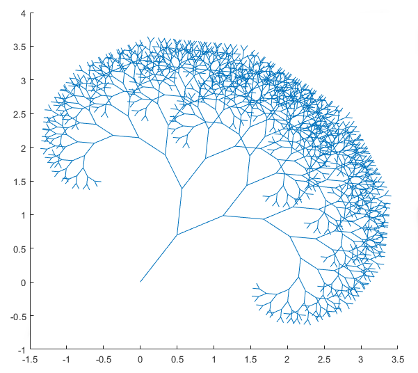
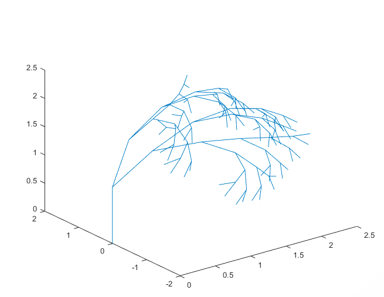
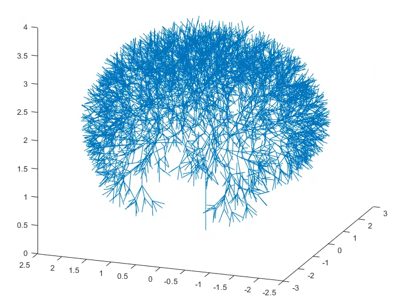

# **Réalisation d'une image fractale**

> UTBM - P2023 - MV51 - TP2 - Julien CONSTANT

**On rapporte le plan affine au repère $(o, \vec{i}, \vec{j})$**  
**On considère le segment $\mathcal{M}_0 =[oa]$, où $a(0, 1)$**

## **1. Lemmes techniques**

1. **Écrire une fonction $homothetie(k)$ qui à partir du réel $k$ non nul, renvoie la matrice projective $H$ de l'homothétie de centre $o$ et de rapport $k$.**

    ```matlab
    function H = homothetie(k)
        % Initialise une matrice identité
        H = eye(3);
        % Applique le facteur d'échelle sur les dimensions x et y
        H(1 : dim - 1, 1 : dim - 1) = H(1 : dim - 1, 1 : dim - 1) * k;
    end
    ```

    > La fonction homothétie crée une matrice de transformation homothétique en utilisant un facteur d'échelle $k$. La matrice est initialisée comme une matrice identité de dimension 3. Ensuite, le facteur d'échelle est appliqué aux dimensions $x$ et $y$ de la matrice en multipliant les sous-matrices correspondantes.

    Exemple :

    ```matlab
    >> homothetie(3)

    ans =

        3     0     0
        0     3     0
        0     0     1
    ```

2. **Écrire une fonction $rotation(\alpha)$ qui à partir de la mesure $\alpha$ considérée comme un réel ou un symbolique, renvoie la matrice projective $R$ de la rotation de centre $o$ et d’angle $\alpha$.**

    ```matlab
    function R = rotation(alpha)
        R = [
            [cos(alpha), - sin(alpha), 0];
            [sin(alpha), cos(alpha), 0];
            [0, 0, 1]
        ];
    end
    ```

    > La fonction rotation crée une matrice de transformation de rotation en utilisant un angle $\alpha$. La matrice de rotation est construite en utilisant cosinus et sinus. La matrice résultante est une matrice 3x3 où les éléments $[1, 1]$ et $[2, 2]$ sont déterminés par $cos(\alpha)$, les éléments $[1, 2]$ et $[2, 1]$ sont déterminés par $-sin(\alpha)$, et les éléments $[3, 3]$ sont égaux à 1.

    Exemple :

    ```matlab
    >> rotation(pi/2)

    ans =

        0.0000   -1.0000         0
        1.0000    0.0000         0
             0         0    1.0000
    ```

3. **Écrire une fonction $translate(a)$ qui à partir du point $a$ connu par ses coordonnées dans le repère proposé, renvoie la matrice projective $T$ de la translation de vecteur $\vec{oa}$.**

    ```matlab
    function T = translation(a)
        T = eye(3);
        % Transpose le vecteur de translation pour l'adapter aux dimensions 
        % de la matrice
        a = transpose(a);

        % Affecte les composantes x et y du vecteur de translation aux 
        % éléments correspondants de la matrice
        T(1 : 2, 3) = a;
    end
    ```

    > La fonction translation crée une matrice de transformation de translation en utilisant un vecteur de translation $a$. La matrice est initialement définie comme une matrice identité de dimension 3. Ensuite, le vecteur de translation est transposé pour s'adapter aux dimensions de la matrice de transformation. Les composantes $x$ et $y$ du vecteur de translation sont ensuite assignées aux éléments correspondants de la matrice de translation (colonne 3, lignes 1 et 2).

    Exemple :

    ```matlab
    >> translation([2, 3])

    ans =
        1     0     2
        0     1     3
        0     0     1
    ```

<br>

## **2. Construction d'une fractale**

1. **Principe**

    **On considère l'ensemble de transformations du plan $G = \\{g_0, g_1, g_2\\}$ où $g_0 = id$, $g_1 = t \circ r_1 \circ h$ et $g_2 = t \circ r_2 \circ h$**

    - **$t$ désigne la translation décrite ci-dessus ;**
    - **$h$ désigne l'homothétie décrite ci-dessus ;**
    - **$r_1, r_2$ désignent respectivement les rotations décrites ci-dessus d'angles respectifs $\alpha$ et $- \alpha$.**

    <b>On construit alors :</b>
    <p align="center">
        
    </p>

2. **Écrire une fonction $fract2(\mathcal{M₀})$ qui génère l'image fractale $I_{\mathcal{M}_{0}}$ décrite ci-dessus.**

    ```matlab
    function fract2(M0, depth, alpha, h)
        o = M0(:, 1); % Point initial de la fractale
        a = M0(:, 2); % Point final de la fractale
        t = a - o; % Vecteur de translation entre les deux points

        % Trace une ligne entre les deux points
        line([o(1); a(1)], [o(2); a(2)]);

        if depth > 0
            % Réduit la profondeur de 1 à chaque récursion
            depth = depth - 1;

            % Génère les transformations pour la première récursion
            g1 = translation(t) * rotation(alpha) * homothetie(h) * [a(1) - o(1); a(2) - o(2); 1];
            M_1 = [a(1), o(1) + g1(1); a(2), o(2) + g1(2)];
            fract2(M_1, depth, alpha, h);

            % Génère les transformations pour la deuxième récursion
            g2 = translation(t) * rotation(- alpha) * homothetie(h) * [a(1) - o(1); a(2) - o(2); 1];
            M_2 = [a(1), o(1) + g2(1); a(2), o(2) + g2(2)];
            fract2(M_2, depth, alpha, h);
        end
    end
    ```

    > La fonction `fract2` extrait d'abord les points de départ $o$ et d'arrivée $a$ de la matrice $\mathcal{M}_0$. Ensuite on calcul le vecteur de translation $t$ et on trace avec `line` la première itération de la fractale. Enfin on execute l'algorithme récursivement avec pour chaque récursion l'application d'une transformation au vecteur $t$ dans l'ordre suivant : translation, rotation et homothétie. On obtient alors les coordonnées $\mathcal{M}_1$ et $\mathcal{M}_2$ en ajoutant les composantes transformées au point d'origine. Finalement on rappel la fonction `fract2` en diminuant la profondeur de 1 et en lui indiquant $\mathcal{M}_1$ et $\mathcal{M}_2$.

    Exemple :

    ```matlab
    >> fract2([0, 0; 0, 1], 10, pi/6, .8);
    ```

    <p align="center">
        
    </p>

3. **Réutiliser la fonction précédente pour générer une image $I_{\mathcal{M}_0^\prime}$ issue d'un motif de base différent.**

    ```matlab
    >> fract2([0, .5; 0, .7], 10, pi/6, .8);
    ```

    <p align="center">
        
    </p>

<br/>

4. **Prolongement éventuels, proposez une version en trois dimensions de la question précédente**

    ### Homothétie en trois dimensions

    ```matlab
    function H = homothetie3(k)
        H = eye(4);
        H(1 : 3, 1 : 3) = H(1 : 3, 1 : 3) * k;
    end
    ```

    Exemple :

    ```matlab
    >> homothetie3(3)

    ans =
        3     0     0     0
        0     3     0     0
        0     0     3     0
        0     0     0     1
    ```

    ### Rotation en trois dimensions

    ```matlab
    function R = rotation3(alpha_x, alpha_y, alpha_z)
        Rx = [
            1,            0,              0, 0;
            0, cos(alpha_x), - sin(alpha_x), 0;
            0, sin(alpha_x),   cos(alpha_x), 0;
            0,            0,              0, 1
        ];

        Ry = [
              cos(alpha_y), 0, sin(alpha_y), 0;
                         0, 1,            0, 0;
            - sin(alpha_y), 0, cos(alpha_y), 0;
                         0, 0,            0, 1
        ];

        Rz = [
            cos(alpha_z), - sin(alpha_z), 0, 0;
            sin(alpha_z),   cos(alpha_z), 0, 0;
                       0,              0, 1, 0;
                       0,              0, 0, 1
        ];
    end
    ```

    <br/>
    <br/>
    Exemple :

    ```matlab
    >> rotation3(pi/2, pi/2, pi/2)

    ans =
        0.000     0.000     1.000     0.000
        0.000     1.000     0.000     0.000
       -1.000     0.000     0.000     0.000
        0.000     0.000     0.000     1.000
    ```

    ### Translation en trois dimensions

    ```matlab
    function T = translation3(t)
        t = transpose(t);
        T = eye(4);
        T(1 : 3, 4) = t;
    end
    ```

    Exemple :

    ```matlab
    >> translation3([1, 2, 3])

    ans = 
        1     0     0     1
        0     1     0     2
        0     0     1     3
        0     0     0     1
    ```

    <br/>
    <br/>
    <br/>
    <br/>
    <br/>
    <br/>
    <br/>
    <br/>
    <br/>
    <br/>
    <br/>
    <br/>
    <br/>
    <br/>
    <br/>
    <br/>

    ### Fractale en 3 dimensions

    ```matlab
    function fract3(M0, depth, alpha, h)
        o = M0(:, 1); % Point initial de la fractale
        a = M0(:, 2); % Point final de la fractale
        t = a - o; % Vecteur de translation entre les deux points

        % Trace une ligne entre les deux points
        line(M0(1, :), M0(2, :), M0(3, :));

        if depth > 0:
            depth = depth - 1;

            % Calcul des points de la récursion
            g1 = translation3(t) * rotation3(alpha, alpha, 0) * homothetie3(h) * [a(1) - o(1); a(2) - o(2); a(3) - o(3); 1];
            M_1 = [a(1), o(1) + g1(1); a(2), o(2) + g1(2); a(3), o(3) + g1(3)];
            fract3(M_1, depth, alpha, h);

            g2 = translation3(t) * rotation3(- alpha, alpha, 0) * homothetie3(h) * [a(1) - o(1); a(2) - o(2); a(3) - o(3); 1];
            M_2 = [a(1), o(1) + g2(1); a(2), o(2) + g2(2); a(3), o(3) + g2(3)];
            fract3(M_2, depth, alpha, h);
        end
    end       
    ```

    Exemple :

    ```matlab
    >> fract3([0, 0; 0, 0; 0, 1], 6, pi/6, .8);
    ```

    <p align="center">
        
    </p>

    <br/>
    <br/>

    On remarque que la fractale ne parait pas "complète", pour palier à cela, on peut modifier la fonction `fract3` pour lui ajouter des récursions supplémentaires :

    ```matlab
    g3 = translation3(t) * rotation3(alpha, - alpha, 0) * homothetie3(h) * [a(1) - o(1); a(2) - o(2); a(3) - o(3); 1];
    M_3 = [a(1), o(1) + g3(1); a(2), o(2) + g3(2); a(3), o(3) + g3(3)];
    fract3(M_3, depth, alpha, h);

    g4 = translation3(t) * rotation3(- alpha, - alpha, 0) * homothetie3(h) * [a(1) - o(1); a(2) - o(2); a(3) - o(3); 1];
    M_4 = [a(1), o(1) + g4(1); a(2), o(2) + g4(2); a(3), o(3) + g4(3)];
    fract3(M_4, depth, alpha, h);
    ```

    Exemple :

    ```matlab
    >> fract3([0, 0; 0, 0; 0, 1], 6, pi/6, .8);
    ```

    <p align="center">
        
    </p>